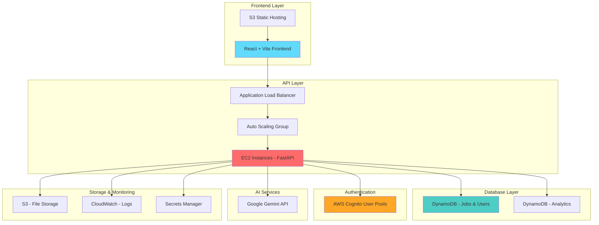

# CareerVault - AI-Powered Job Application Tracking System


## 🎯 Overview

**CareerVault** is an AI-powered job application tracking system built with React frontend, FastAPI backend, and AWS cloud infrastructure. Track applications, analyze resumes with AI, and get career insights.

### ✨ Features
- 📊 Job application tracking with status management
- 🤖 AI resume analysis using Google Gemini
- 📈 Analytics dashboard with visual insights
- 🔐 Secure authentication with AWS Cognito
- ☁️ Fully serverless AWS architecture

## 🏗️ System Architecture



## 💰 AWS Services & Cost Breakdown

| Service | Purpose | Monthly Cost | Why We Use It |
|---------|---------|--------------|---------------|
| **EC2 (t3.medium)** | Backend API hosting | $60 | Reliable compute with auto-scaling |
| **Application Load Balancer** | Traffic distribution | $22 | High availability & health checks |
| **DynamoDB** | NoSQL database | $5-15 | Serverless, auto-scaling, <1ms latency |
| **S3** | Static website + storage | $1-3 | Cost-effective storage, CDN ready |
| **Cognito** | User authentication | $4 | Managed auth, MFA, social logins |
| **CloudWatch** | Monitoring & logs | $5 | Real-time monitoring, alerting |
| **Auto Scaling Group** | Instance management | Free | Automatic scaling, fault tolerance |
| **VPC & Security Groups** | Network security | Free | Isolated network, firewall rules |
| **IAM Roles** | Access management | Free | Secure service-to-service access |
| **Secrets Manager** | API key storage | $1 | Secure credential management |
| **Total Monthly Cost** | | **~$100-110** | Production-ready scalable solution |

### 🔄 Application Flow

```
User Request → CloudFront/S3 → React App → ALB → EC2 (FastAPI) → DynamoDB
                                                    ↓
                                            Google Gemini API (AI Analysis)
                                                    ↓
                                            AWS Cognito (Authentication)
```

## 🚀 Quick Start Commands

### Prerequisites
```bash
# Install required tools
node -v    # Node.js 18+
python -v  # Python 3.11+
aws --version  # AWS CLI v2
terraform -v   # Terraform 1.0+
```

### Local Development
```bash
# 1. Clone repository
git clone https://github.com/AyushChoudhary6/CareerVault.git
cd CareerVault

# 2. Start backend
cd backend
pip install -r requirements.txt
python main.py
# Backend runs on http://localhost:8000

# 3. Start frontend (new terminal)
cd vite-project
npm install
npm run dev
# Frontend runs on http://localhost:5173
```

### AWS Deployment
```bash
# 1. Configure AWS credentials
aws configure
# Enter: Access Key, Secret Key, Region (ap-south-1), Output (json)

# 2. Deploy infrastructure
cd infra/terraform

# Deploy networking
cd networking
terraform init
terraform apply -var-file="networking.tfvars"

# Deploy backend services
cd ../backend
terraform init
terraform apply -var-file="backend.tfvars"

# Deploy frontend hosting
cd ../frontend
terraform init
terraform apply -var-file="frontend.tfvars"

# 3. Deploy application code
# Frontend
cd ../../vite-project
npm run build
aws s3 sync dist/ s3://your-frontend-bucket/

# Backend deployment is automated via EC2 user-data scripts
```

### Environment Configuration
```bash
# Backend environment variables (.env)
AWS_REGION=ap-south-1
DYNAMODB_USERS_TABLE=CareerVault-Users
DYNAMODB_JOBS_TABLE=CareerVault-Jobs
COGNITO_USER_POOL_ID=your-pool-id
GEMINI_API_KEY=your-gemini-key

# Frontend environment variables (.env)
VITE_API_URL=https://your-alb-dns.amazonaws.com
VITE_COGNITO_USER_POOL_ID=your-pool-id
VITE_COGNITO_APP_CLIENT_ID=your-client-id
```

## 🛠️ Technology Stack

### Frontend
- **React 18** - Modern UI framework
- **Vite** - Fast build tool and dev server
- **Tailwind CSS** - Utility-first styling
- **Chart.js** - Data visualization

### Backend
- **FastAPI** - High-performance Python web framework
- **Python 3.11** - Latest Python with type hints
- **Pydantic** - Data validation and serialization
- **Boto3** - AWS SDK for Python

### Infrastructure
- **AWS** - Cloud platform
- **Terraform** - Infrastructure as Code
- **Docker** - Local development containerization

## 📊 AWS Architecture Benefits

### Why DynamoDB?
- **Serverless**: No server management required
- **Auto-scaling**: Handles traffic spikes automatically
- **Performance**: Single-digit millisecond response times
- **Cost-effective**: Pay only for what you use
- **Global**: Easy multi-region deployment

### Why Auto Scaling Group?
- **High Availability**: Automatic instance replacement
- **Cost Optimization**: Scale down during low traffic
- **Zero Downtime**: Rolling deployments
- **Health Monitoring**: Automatic unhealthy instance replacement

### Why Application Load Balancer?
- **SSL Termination**: Handles HTTPS encryption
- **Health Checks**: Routes traffic only to healthy instances
- **Multi-AZ**: Distributes traffic across availability zones
- **WebSocket Support**: Real-time features ready

## 🔧 API Endpoints

### Authentication
```bash
POST /auth/signup     # User registration
POST /auth/login      # User login
GET  /auth/me         # Get current user
```

### Job Management
```bash
GET    /api/jobs           # List all jobs
POST   /api/jobs           # Create new job
GET    /api/jobs/{id}      # Get specific job
PUT    /api/jobs/{id}      # Update job
DELETE /api/jobs/{id}      # Delete job
GET    /api/jobs/stats     # Job statistics
```

### AI Features
```bash
POST /api/ai/analyze-resume      # Resume analysis
POST /api/ai/analyze-job-fit     # Job-resume matching
```

## 🔒 Security Features

- **AWS Cognito**: Multi-factor authentication, password policies
- **VPC**: Isolated network environment
- **Security Groups**: Firewall rules for each service
- **IAM Roles**: Least privilege access
- **HTTPS**: SSL/TLS encryption in transit
- **Encryption at Rest**: DynamoDB and S3 encryption

## 📈 Monitoring & Logging

- **CloudWatch Metrics**: Application and infrastructure monitoring
- **CloudWatch Logs**: Centralized logging
- **Health Checks**: Load balancer health monitoring
- **Auto Scaling Metrics**: CPU, memory, request count
- **DynamoDB Metrics**: Read/write capacity, throttling

## 🗂️ Project Structure
```
CareerVault/
├── 📂 backend/              # FastAPI application
│   ├── main.py              # Application entry point
│   ├── requirements.txt     # Python dependencies
│   └── 📂 app/              # Application modules
├── 📂 vite-project/         # React frontend
│   ├── src/                 # Source code
│   ├── package.json         # Node dependencies
│   └── dist/                # Build output
├── 📂 infra/terraform/      # Infrastructure code
│   ├── networking/          # VPC, subnets, security
│   ├── backend/             # ALB, ASG, DynamoDB
│   └── frontend/            # S3 static hosting
└── docker-compose.yml       # Local development setup
```

## 🚀 Deployment Options

### Option 1: Full AWS Deployment
- Production-ready with auto-scaling
- ~$100-110/month cost
- High availability across multiple AZs

### Option 2: Minimal AWS Deployment
- Single instance, smaller RDS
- ~$30-50/month cost
- Good for testing and small workloads

### Option 3: Local Development
- Docker Compose setup
- Free to run locally
- Perfect for development and testing

## 🔄 CI/CD Pipeline (Future)

```bash
# Planned automation
GitHub Actions → Build → Test → Deploy to AWS
         ↓
    Terraform Plan → Manual Approval → Terraform Apply
         ↓
    Frontend Build → S3 Upload → CloudFront Invalidation
         ↓
    Backend Build → ECR Push → ECS Rolling Update
```

## 📞 Support

- **GitHub Issues**: Bug reports and feature requests
- **Documentation**: Inline code documentation
- **Email**: support@careervault.app

## 📄 License

MIT License - See [LICENSE](LICENSE) file

---

**Built with ❤️ using AWS, React, and FastAPI**


